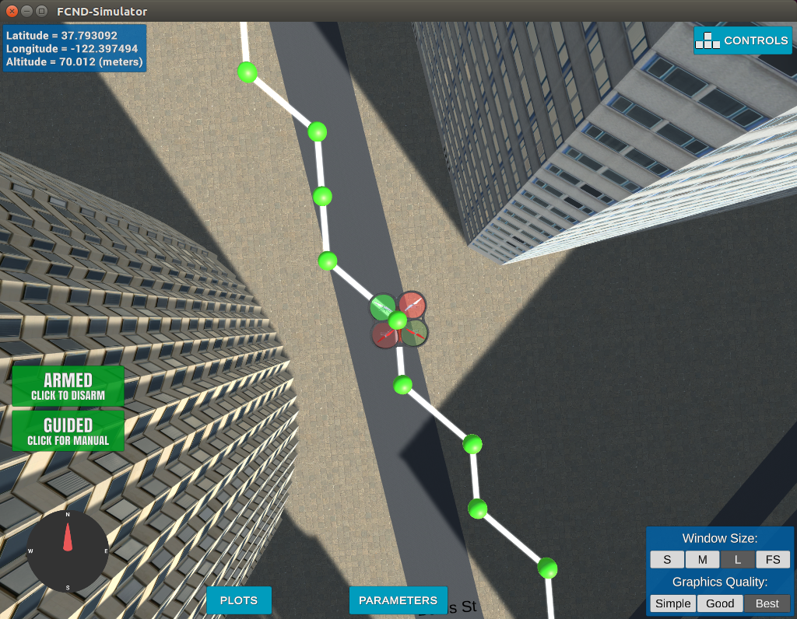

# Project: 3D Motion Planning


---


## Required Steps for a Passing Submission:
1. Load the 2.5D map in the colliders.csv file describing the environment.
2. Discretize the environment into a grid or graph representation.
3. Define the start and goal locations.
4. Perform a search using A* or other search algorithm.
5. Use a collinearity test or ray tracing method (like Bresenham) to remove unnecessary waypoints.
6. Return waypoints in local ECEF coordinates (format for `self.all_waypoints` is [N, E, altitude, heading], where the drone’s start location corresponds to [0, 0, 0, 0].
7. Write it up.
8. Congratulations!  Your Done!

## [Rubric](https://review.udacity.com/#!/rubrics/1534/view) Points
Here I will consider the rubric points individually and describe how I addressed each point in my implementation.  

---
### Writeup / README

#### 1. Provide a Writeup / README that includes all the rubric points and how you addressed each one.  You can submit your writeup as markdown or pdf.  

You're reading it! Below I describe how I addressed each rubric point and where in my code each point is handled.

### Explain the Starter Code

#### 1. Explain the functionality of what's provided in `motion_planning.py` and `planning_utils.py`

There are 2 main scripts associated with this project:
 * `planning_utils.py` provides any the utility functions needed to facilitate planning.
   * `create_grid` A function that returns a grid representation of a 2D configuration space based on given obstacle data, drone altitude and safety distance arguments.
   * `Action`: An enumeration class where each action is reepresented by a 3 element tuple. The first two values are the delta of the action relative to the current grid position.  The third value is the cost of performing that action.
   * `valid_actions`: A function that returns a list of valid actions given a grid and current node.
   * `a_star`: A function implementation of the A* algorithm.
   * `heuristic`: The function used by A* to estimate the remaining distance to the goal. 
 * `motion_planning.py` The main script for running the motion planning solution.
   * `States`: An enumeration class used for transitioning between states.
   * `MotionPlanning`: The class that describes all attributes and functionality associated with a Drone instance.

### Implementing Your Path Planning Algorithm

#### 1. Set your global home position

No change required.
The drone global position in the Sim already exactly matches that of colliders.csv. 

#### 2. Set your current local position
No change required.
The drone local position in the Sim already exactly matches that of colliders.csv. 

#### 3. Set grid start position from local position
Use local position rounded to nearest integer for grid start.
Again, the local position and home position are equal by default. So grid start will always be (0, 0).

#### 4. Set grid goal position from geodetic coords
Steps to get geodetic coords for grid goal position:
 1. Run Sim in manual mode.
 2. Fly drone to new position of your choosing.
 3. Observe lat/lon as displayed in upper left corner of Sim and hard code the values in global_goal variable.
 4. Use global_to_local to convert global_goal to local_goal.
 5. Convert local_goal to grid_goal using north and east grid offsets.
 
The rubric states that this step is meant to add flexibility to the desired goal location.
The rather laborious steps above suggest otherwise.  Is there a better way?

#### 5. Modify A* to include diagonal motion (or replace A* altogether)
Incorporated diagonal motion into route planning.  I did not modify the A* algorithm itself, rather I added the 4 additional diagonal actions to the `Actions` class and 4 new conditional tests to `valid_actions`.

#### 6. Cull waypoints 
Added two functions to handle culling waypoints:
 * `collinear`: checks if 3 consecutive points are collinear.
 * `zigzag`: checks if 4 consecutive points form a perfect zigzag pattern. (See figure below) Specifically, we create a `Shapely.Polygon` with the 4 points and simply check if the area is 0.  If so, the middle 2 points are marked for culling.  This method works well for off-axis paths where standard collinear checks would normally fail.

```python
# Example
#            p3-----p4
#           /
#          /
# p1-----p2

from shapely.geometry import Polygon

p1 = (0, 0)
p2 = (2, 0)
p3 = (3, 2)
p4 = (5, 2)

p = Polygon([p1, p2, p3, p4])
assert p.area <= 1e-7
```

Both functions are wrapped into a single function `prune` which is called on the A* path before creating the waypoins.



### Execute the flight
#### 1. Does it work?
It works! The global goal illustrates landing on the rooftop of a building.  

Note: The Rubric specifications for this section suggest **starting from a different point in the city** however I was unable to find anywhere in the project description (git repo, lesson videos, knowledge base) instructions on how to do this.  `self.local_position` cannot be set directly as it has no setter property.  If I have overlooked them please provide a link, else please update the appropriate sections in the project description describing how to do so.    
# Extra Challenges: Real World Planning

For an extra challenge, consider implementing some of the techniques described in the "Real World Planning" lesson. You could try implementing a vehicle model to take dynamic constraints into account, or implement a replanning method to invoke if you get off course or encounter unexpected obstacles.


